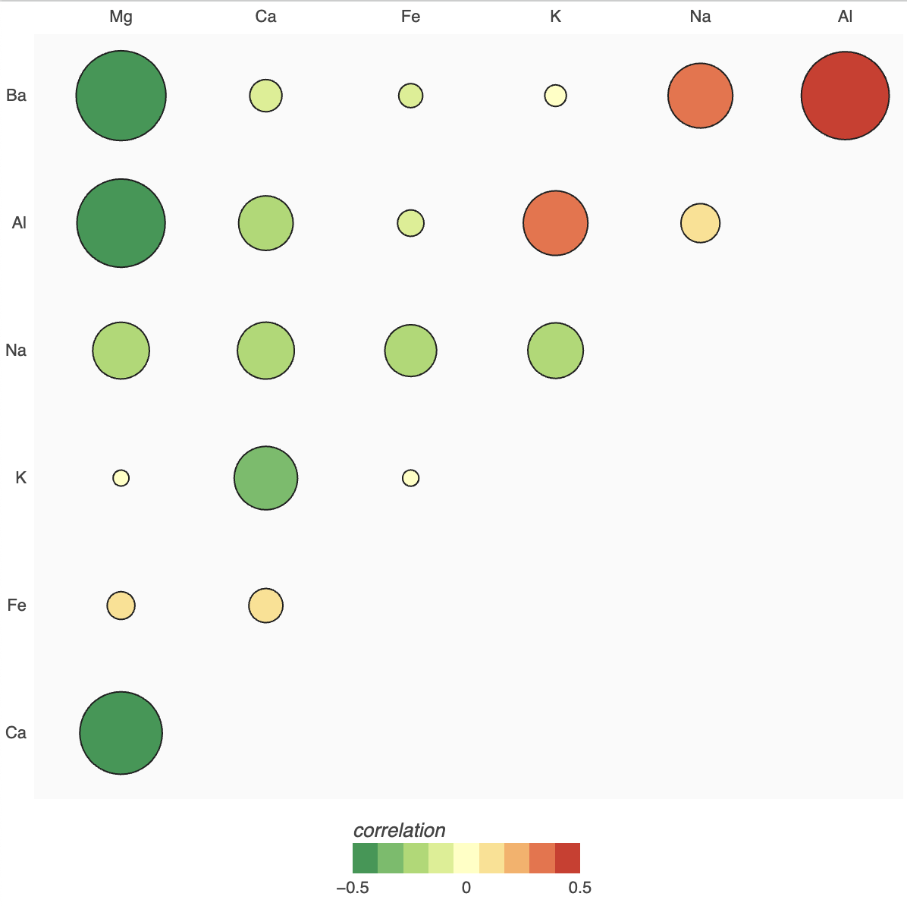

# Correlogram

# Alternative names: 
- correlation matrix, correlation graph

# Functions & Purpose:
- Helping in understanding the correlation between multiple variables in a dataset by showing the correlation coefficients between pairs of variables in a dataset.
- Purpose is to identify patterns, trends and or relationships among variables.
- Useful in exploratory data analysis to check for potential relationships or redundancies.

# Aesthetics used:
- Colors
- Position
- Sizes

# Potential pitfalls:
- Too many variables can make the correlogram cluttered and difficult to interpret.
- If the color scale lacks contrast or is not intuitive it may lead to misinterpretations.
- Assuming that correlation implies causation. This mistake occurs when concluding that one variable causes another simply because they are correlated.

- [Example](correlogram.ipynb)

## Multiple choice questions

"What is a common pitfall when interpreting correlograms?"

- A) Assuming correlation implies causation.
- B) Ignoring the aesthetic representation.
- C) Considering it only suitable for small datasets.
- D) Using only for categorical data.

Correct answer: A)
